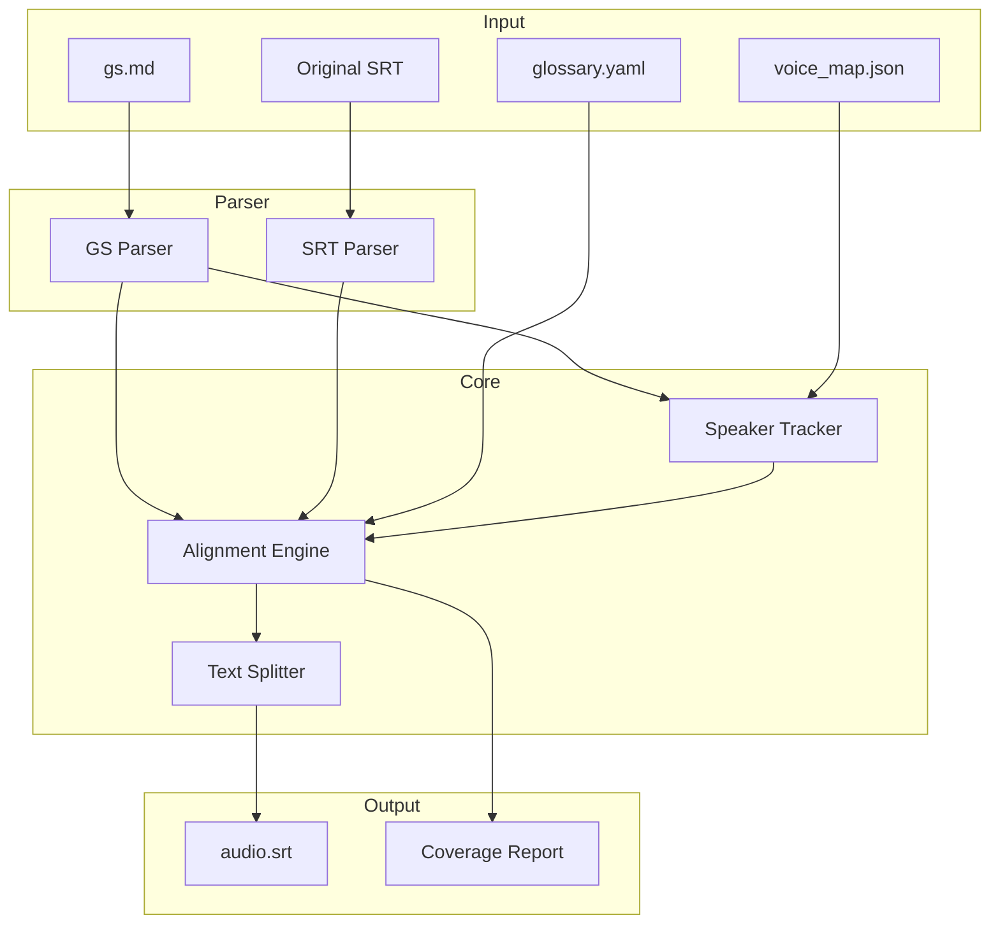

# Design Document: GS-Align Multi-Speaker

## Overview

This design describes an improved alignment system that generates complete, high-quality `audio.srt` files from `gs.md` reference documents with full multi-speaker support. The system addresses the current limitation where only 240 of 414 entries are generated due to incomplete gs.md coverage and lack of speaker tracking.

## Architecture



## Components and Interfaces

### 1. GS Parser (`GSParser`) - 语义解析

使用 LLM 进行语义解析 gs.md 文件，而非简单的正则匹配。这样可以更准确地理解文档结构和内容。

```python
@dataclass
class GSSegment:
    start_ms: int
    speaker: str
    text: str
    section_type: str  # 'transcript', 'glossary', 'notes', 'learning'
    
class GSParser:
    def __init__(self, use_llm: bool = True):
        self.use_llm = use_llm
        
    def parse(self, gs_path: Path) -> List[GSSegment]:
        """
        语义解析 gs.md，提取逐字稿段落。
        
        使用 LLM 理解文档结构：
        1. 识别"完整逐字稿"部分（主要内容）
        2. 排除"图像补充说明"、"重要术语"、"学习收获"等非逐字稿部分
        3. 提取时间锚点和对应的说话人
        4. 清理文本（移除 Markdown 格式、括号注释等）
        """
        
    def extract_speakers(self, gs_path: Path) -> List[str]:
        """提取所有唯一说话人名称。"""
        
    def identify_sections(self, content: str) -> Dict[str, str]:
        """
        语义识别文档各部分：
        - 基本信息
        - 完整逐字稿（主要内容）
        - 图像补充说明（排除）
        - 重要术语和人物（排除）
        - 学习收获（排除）
        """
```

**语义解析策略：**

1. **文档结构识别**：
   - 识别 `## 完整逐字稿` 部分作为主要内容来源
   - 排除 `## 🔍 图像补充说明`、`## 📚 重要术语`、`## 💡 学习收获` 等辅助部分
   - 处理 `## 完整逐字稿（继续 Q&A 部分）` 等延续部分

2. **时间锚点提取**：
   - 格式：`### [MM:SS] Speaker_Name`
   - 说话人名称支持中英文混合（如 `观众提问 2 (Janet)`）

3. **内容清理**：
   - 移除括号中的英文原文（如 `修辞学（Rhetoric）` → `修辞学`）
   - 保留必要的术语翻译对照
   - 移除图像描述行（`**[MM:SS]** 画面内容：...`）

4. **LLM 辅助理解**：
   - 当文档结构复杂时，使用 LLM 理解段落边界
   - 识别说话人切换的语义线索
   - 处理非标准格式的时间标记

### 2. Speaker Tracker (`SpeakerTracker`)

Tracks current speaker and manages speaker-to-voice mappings.

```python
class SpeakerTracker:
    def __init__(self, voice_map_path: Optional[Path] = None):
        self.voice_map: Dict[str, str] = {}
        self.current_speaker: str = "DEFAULT"
        
    def update_speaker(self, timestamp_ms: int, gs_segments: List[GSSegment]) -> str:
        """Get speaker for given timestamp based on gs.md anchors."""
        
    def get_voice(self, speaker: str) -> str:
        """Get TTS voice for speaker from voice_map."""
        
    def generate_voice_map(self, speakers: List[str]) -> Dict[str, str]:
        """Generate voice_map.json template with all speakers."""
```

### 3. Alignment Engine (`AlignmentEngine`)

Core component that maps gs.md translations to original SRT timeline.

```python
class AlignmentEngine:
    def __init__(
        self,
        gs_segments: List[GSSegment],
        original_subs: List[srt.Subtitle],
        glossary: Optional[Dict[str, str]] = None
    ):
        pass
        
    def align(self) -> List[AlignedSubtitle]:
        """
        Align gs.md content to original SRT timeline.
        
        Algorithm:
        1. For each original SRT entry, find the gs.md segment that covers it
        2. If covered, use gs.md translation
        3. If not covered (beyond last anchor), use original SRT text as fallback
        4. Track speaker changes based on gs.md anchors
        """
        
    def get_coverage_stats(self) -> CoverageStats:
        """Return statistics about gs.md coverage."""
```

**Alignment Algorithm:**

```
For each original_sub in original_subs:
    sub_start_ms = original_sub.start.total_seconds() * 1000
    
    # Find which gs segment covers this timestamp
    covering_segment = None
    for i, gs_seg in enumerate(gs_segments):
        gs_start = gs_seg.start_ms
        gs_end = gs_segments[i+1].start_ms if i+1 < len(gs_segments) else infinity
        
        if gs_start <= sub_start_ms < gs_end:
            covering_segment = gs_seg
            break
    
    if covering_segment:
        # Use gs.md translation, distribute text proportionally
        text = distribute_text(covering_segment, original_sub, all_subs_in_segment)
        speaker = covering_segment.speaker
    else:
        # Fallback to original SRT (beyond gs.md coverage)
        text = original_sub.content
        speaker = last_known_speaker
        mark_as_fallback()
    
    output.append(AlignedSubtitle(
        index=original_sub.index,
        start=original_sub.start,
        end=original_sub.end,
        text=text,
        speaker=speaker
    ))
```

### 4. Text Splitter (`TextSplitter`)

Handles text processing for TTS optimization.

```python
class TextSplitter:
    MAX_CHARS = 75  # Doubao TTS limit
    
    def clean_markdown(self, text: str) -> str:
        """Remove markdown formatting, image descriptions, etc."""
        
    def split_for_tts(self, text: str, max_chars: int = MAX_CHARS) -> List[str]:
        """Split text at natural boundaries (。！？，；) if exceeding limit."""
        
    def remove_fillers(self, text: str) -> str:
        """Remove oral fillers like 嗯、啊、呃."""
```

### 5. Output Generator

Generates the final audio.srt with optional speaker tags.

```python
def generate_audio_srt(
    aligned_subs: List[AlignedSubtitle],
    include_speaker_tags: bool = True
) -> str:
    """
    Generate SRT content with optional speaker tags.
    
    Format with tags: "[Speaker: Ian Bogost] 这是翻译文本"
    Format without tags: "这是翻译文本"
    """
```

## Data Models

```python
@dataclass
class GSSegment:
    start_ms: int
    speaker: str
    text: str

@dataclass
class AlignedSubtitle:
    index: int
    start: timedelta
    end: timedelta
    text: str
    speaker: str
    is_fallback: bool = False

@dataclass
class CoverageStats:
    total_entries: int
    covered_entries: int
    fallback_entries: int
    coverage_percent: float
    last_anchor_time: str
    video_duration: str
```

## 正确性属性

*正确性属性是指在系统所有有效执行中都应保持为真的特征或行为——本质上是关于系统应该做什么的形式化陈述。属性是人类可读规范与机器可验证正确性保证之间的桥梁。*

### Property 1: 条目数量保持不变

*对于任意* 有效的 gs.md 和原始 SRT 输入对，生成的 audio.srt 条目数量应与原始 SRT 条目数量完全相等。

**Validates: Requirements 1.1, 1.3**

### Property 2: 未覆盖段落的回退行为

*对于任意* gs.md 最后一个时间锚点之后的 SRT 条目，其文本内容应来自原始 SRT 的对应条目。

**Validates: Requirements 1.2, 6.1**

### Property 3: 段落到锚点的正确映射

*对于任意* 位于两个 gs.md 时间锚点之间的 SRT 条目，其翻译文本应来自前一个锚点对应的 gs.md 内容段落。

**Validates: Requirements 1.4**

### Property 4: 说话人名称提取

*对于任意* 格式为 `### [MM:SS] Speaker_Name` 的 gs.md 锚点，解析器应正确提取说话人名称（锚点中时间戳之后的所有内容）。

**Validates: Requirements 2.1**

### Property 5: 说话人标签传播

*对于任意* 说话人锚点之后的 SRT 条目序列，在遇到下一个说话人锚点之前，所有条目都应标记为当前说话人，且输出格式应为 `[Speaker: Name] Text`。

**Validates: Requirements 2.3, 2.4, 7.4**

### Property 6: 默认音色回退

*对于任意* 不在 voice_map.json 中的说话人名称，系统应返回 DEFAULT 对应的音色。

**Validates: Requirements 3.2**

### Property 7: 说话人验证完整性

*对于任意* gs.md 中出现的说话人，如果其不在 voice_map.json 中，系统应生成警告信息。

**Validates: Requirements 3.3**

### Property 8: 音色映射生成完整性

*对于任意* gs.md 文件，生成的 voice_map.json 应包含该文件中所有唯一的说话人名称。

**Validates: Requirements 3.4**

### Property 9: 文本清理（Markdown、图片描述、口语填充词）

*对于任意* 包含 Markdown 格式（**粗体**、# 标题、- 列表）、图片描述（`**[MM:SS]** 画面内容：...`）或口语填充词（嗯、啊、呃）的输入文本，输出文本应不包含这些内容。

**Validates: Requirements 4.1, 4.2, 4.5**

### Property 10: 段落分割遵守字符限制

*对于任意* 超过 75 字符的文本段落，分割后的每个子段落长度应 ≤75 字符，且分割点应位于自然标点符号处（。！？，；）。

**Validates: Requirements 4.3**

### Property 11: 术语一致性检查

*对于任意* 存在 glossary.yaml 的项目，系统应检测 gs.md 中与术语表不一致的翻译用法。

**Validates: Requirements 5.2**

### Property 12: 覆盖率统计准确性

*对于任意* gs.md 和 SRT 输入对，计算的覆盖率百分比应等于 (被 gs.md 覆盖的条目数 / 总条目数) × 100。

**Validates: Requirements 6.3**

### Property 13: 有效 SRT 输出格式

*对于任意* 生成的 audio.srt 输出，使用 `srt.parse()` 解析应成功且不抛出异常。

**Validates: Requirements 7.1**

### Property 14: 原始结构保持不变

*对于任意* 原始 SRT 输入，生成的 audio.srt 应保持完全相同的索引号和时间戳。

**Validates: Requirements 7.2, 7.3**

## 错误处理

| 错误场景 | 处理方式 |
|---------|---------|
| gs.md 文件不存在 | 抛出 FileNotFoundError，提示用户创建 gs.md |
| gs.md 无有效时间锚点 | 抛出 ValueError，提示锚点格式要求 |
| 原始 SRT 解析失败 | 抛出 srt.SRTParseError，显示具体行号 |
| voice_map.json 格式错误 | 抛出 JSONDecodeError，使用默认映射并警告 |
| glossary.yaml 格式错误 | 警告并跳过术语检查 |
| gs.md 覆盖率 < 80% | 发出警告但继续处理 |
| 单个段落超过 250 字符 | 强制分割并记录警告 |

## 测试策略

### 单元测试

- **GSParser 测试**: 验证各种锚点格式的解析
- **SpeakerTracker 测试**: 验证说话人切换和音色查找
- **TextSplitter 测试**: 验证 Markdown 清理和长文本分割
- **AlignmentEngine 测试**: 验证对齐算法的边界情况

### 属性测试

使用 `hypothesis` 库进行属性测试，每个属性至少运行 100 次迭代。

```python
# 测试框架配置
import hypothesis
from hypothesis import given, strategies as st, settings

@settings(max_examples=100)
```

**测试标签格式**: `Feature: gs-align-multi-speaker, Property {number}: {property_text}`

### 集成测试

- 使用 Ian Bogost 视频项目作为端到端测试用例
- 验证 414 条目完整生成
- 验证 3 个说话人正确识别
- 验证覆盖率报告准确性
