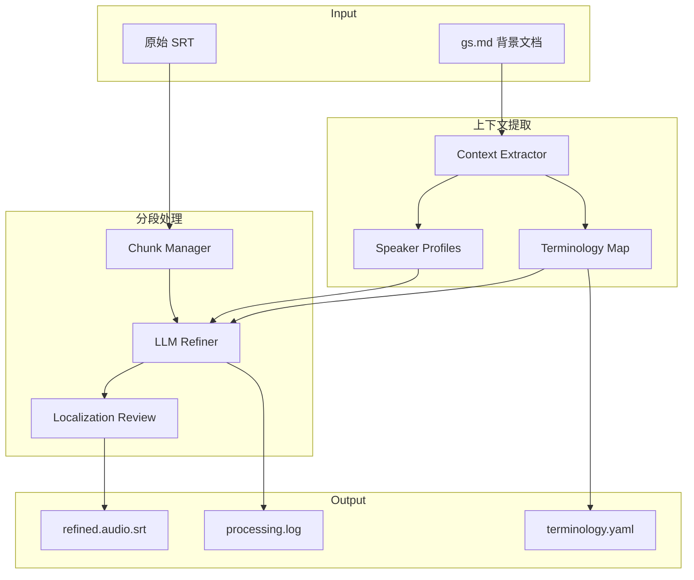

# Design Document: GS 语义矫正 SRT 翻译

## Overview

本设计描述一个使用 gs.md 作为语义背景上下文，通过 LLM 逐步矫正 SRT 翻译的系统。核心思想是将 gs.md 视为参考信息而非直接替换来源，通过语义理解来提升翻译质量，确保中国人可理解。

**设计原则**：
- **语义优先**：理解 gs.md 的核心思想，而非机械匹配
- **分段专注**：处理大文件时保持上下文窗口聚焦
- **本地化审查**：确保翻译对中国人自然可理解
- **Text Immutability**：只修改翻译文本，保持时间戳不变

## Architecture



## Components and Interfaces

### 1. Context Extractor（上下文提取器）

从 gs.md 提取语义上下文，不假设固定结构。

```python
@dataclass
class SemanticContext:
    """gs.md 提取的语义上下文"""
    core_topic: str                    # 核心主题
    domain: str                        # 领域（如：游戏设计、修辞学）
    terminology: Dict[str, str]        # 术语映射 {英文: 中文}
    speakers: List[SpeakerProfile]     # 说话人信息
    key_concepts: List[str]            # 关键概念列表
    translation_style: str             # 翻译风格描述
    raw_content: str                   # 原始内容（供 LLM 参考）

@dataclass
class SpeakerProfile:
    """说话人档案"""
    name: str
    role: str                          # 如：主讲人、观众提问
    speaking_style: str                # 说话风格描述
    first_appearance_ms: int           # 首次出现时间

class ContextExtractor:
    def __init__(self, llm_client: Optional[Any] = None):
        self.llm = llm_client
        
    def extract(self, gs_content: str) -> SemanticContext:
        """
        从 gs.md 提取语义上下文
        
        使用 LLM 理解文档：
        1. 识别核心主题和领域
        2. 提取术语翻译对照
        3. 识别说话人及其风格
        4. 总结关键概念
        """
        
    def extract_terminology(self, content: str) -> Dict[str, str]:
        """
        提取术语映射
        
        识别模式：
        - 英文（中文）格式
        - 术语表部分
        - 首次出现的专业术语
        """
        
    def extract_speakers(self, content: str) -> List[SpeakerProfile]:
        """
        提取说话人信息
        
        识别模式：
        - ### [MM:SS] Speaker_Name 格式
        - 对话上下文中的说话人切换
        """
```

### 2. Chunk Manager（分段管理器）

管理大文件的分段处理，保持上下文连贯。

```python
@dataclass
class Chunk:
    """处理单元"""
    index: int
    items: List[SRTItem]
    start_ms: int
    end_ms: int
    context_summary: str               # 前一个 chunk 的上下文摘要
    terminology_used: Dict[str, str]   # 本 chunk 使用的术语

class ChunkManager:
    DEFAULT_CHUNK_SIZE = 30            # 默认每 chunk 30 条
    MIN_CHUNK_SIZE = 20
    MAX_CHUNK_SIZE = 50
    
    def __init__(self, srt_items: List[SRTItem]):
        self.items = srt_items
        self.chunks: List[Chunk] = []
        self.processed_chunks: List[Chunk] = []
        
    def create_chunks(self) -> List[Chunk]:
        """
        创建处理 chunks
        
        策略：
        1. 默认 30 条为一个 chunk
        2. 在自然断点（长停顿、说话人切换）处分割
        3. 避免在句子中间分割
        """
        
    def get_context_for_chunk(self, chunk_index: int) -> str:
        """
        获取当前 chunk 的上下文
        
        包含：
        - 前一个 chunk 的摘要
        - 已确定的术语映射
        - 当前说话人
        """
        
    def save_checkpoint(self, chunk_index: int, result: List[SRTItem]):
        """保存检查点，支持中断恢复"""
        
    def load_checkpoint(self) -> int:
        """加载检查点，返回下一个待处理的 chunk 索引"""
```

### 3. LLM Refiner（LLM 矫正器）

使用 LLM 进行翻译矫正的核心组件。

```python
class LLMRefiner:
    def __init__(
        self,
        semantic_context: SemanticContext,
        llm_client: Any
    ):
        self.context = semantic_context
        self.llm = llm_client
        
    def refine_chunk(
        self,
        chunk: Chunk,
        previous_context: str
    ) -> Tuple[List[SRTItem], str]:
        """
        矫正一个 chunk 的翻译
        
        Args:
            chunk: 待处理的 chunk
            previous_context: 前一个 chunk 的上下文摘要
            
        Returns:
            (矫正后的 SRT 条目列表, 本 chunk 的上下文摘要)
        """
        
    def build_prompt(self, chunk: Chunk, previous_context: str) -> str:
        """
        构建 LLM prompt
        
        Prompt 结构：
        1. 系统角色：翻译审校专家
        2. 背景信息：gs.md 核心内容摘要
        3. 术语表：已确定的术语映射
        4. 上下文：前一个 chunk 的摘要
        5. 任务：矫正当前 chunk 的翻译
        6. 要求：保持时间戳、确保中国人可理解、术语一致
        """
        
    def parse_response(self, response: str) -> List[SRTItem]:
        """解析 LLM 响应，提取矫正后的翻译"""
```

**LLM Prompt 模板**：

```
你是一位专业的中文翻译审校专家。你的任务是根据参考文档矫正字幕翻译，确保翻译准确、自然、对中国观众易于理解。

## 背景信息
主题：{core_topic}
领域：{domain}
关键概念：{key_concepts}

## 参考文档摘要
{gs_summary}

## 术语表（必须统一使用）
{terminology_table}

## 前文摘要
{previous_context}

## 当前说话人
{current_speaker}

## 待矫正的字幕
{srt_entries}

## 矫正要求
1. 保持原始时间戳不变
2. 使用术语表中的统一翻译
3. 确保翻译对中国人自然可理解
4. 避免生硬的直译
5. 保持说话人的语气风格
6. 每条字幕不超过 75 个字符
7. 如需分割长句，在自然断点处分割

请输出矫正后的字幕，格式为：
[序号] 矫正后的翻译
```

### 4. Localization Reviewer（本地化审查器）

审查翻译的中国人可理解性。

```python
@dataclass
class LocalizationIssue:
    """本地化问题"""
    index: int                         # SRT 条目索引
    issue_type: str                    # 问题类型
    original: str                      # 原文
    suggestion: str                    # 建议
    severity: str                      # 严重程度：warning, error

class LocalizationReviewer:
    def __init__(self, llm_client: Optional[Any] = None):
        self.llm = llm_client
        
    def review(self, items: List[SRTItem]) -> List[LocalizationIssue]:
        """
        审查翻译的本地化质量
        
        检查项：
        1. 不自然的直译
        2. 未解释的专业术语
        3. 过长的句子
        4. 不常用的表达方式
        5. 保留的英文是否必要
        """
        
    def check_literal_translation(self, text: str) -> Optional[str]:
        """检查是否有生硬的直译"""
        
    def check_unexplained_terms(self, text: str) -> Optional[str]:
        """检查是否有未解释的专业术语"""
        
    def check_sentence_length(self, text: str) -> Optional[str]:
        """检查句子长度是否适合 TTS"""
```

### 5. Output Generator（输出生成器）

生成最终输出文件。

```python
class OutputGenerator:
    def generate_srt(
        self,
        items: List[SRTItem],
        include_speaker_tags: bool = True
    ) -> str:
        """生成 SRT 格式输出"""
        
    def generate_terminology_report(
        self,
        terminology: Dict[str, str]
    ) -> str:
        """生成术语表报告（YAML 格式）"""
        
    def generate_processing_log(
        self,
        chunks: List[Chunk],
        issues: List[LocalizationIssue]
    ) -> str:
        """生成处理日志"""
```

## Data Models

```python
@dataclass
class SRTItem:
    start_ms: int
    end_ms: int
    text: str
    speaker: Optional[str] = None
    is_refined: bool = False

@dataclass
class ProcessingState:
    """处理状态（用于中断恢复）"""
    total_chunks: int
    completed_chunks: int
    current_chunk_index: int
    terminology: Dict[str, str]
    last_context_summary: str
    checkpoint_path: str

@dataclass
class RefineResult:
    """矫正结果"""
    items: List[SRTItem]
    terminology_used: Dict[str, str]
    issues: List[LocalizationIssue]
    processing_log: str
```

## 正确性属性

*正确性属性是指在系统所有有效执行中都应保持为真的特征或行为——本质上是关于系统应该做什么的形式化陈述。属性是人类可读规范与机器可验证正确性保证之间的桥梁。*

### Property 1: 时间戳和索引不变性

*对于任意* 输入 SRT 条目，矫正后的条目应保持完全相同的 index、start_ms 和 end_ms。

**Validates: Requirements 3.5, 7.5**

### Property 2: 条目数量保持

*对于任意* 输入 SRT 文件，输出的条目数量应与输入完全相等。

**Validates: Requirements 7.5**

### Property 3: 术语一致性

*对于任意* 在术语表中定义的术语，其在输出中的所有出现都应使用相同的翻译。如果 SRT 中使用了不同的翻译，应被矫正为术语表中的翻译。

**Validates: Requirements 5.1, 5.3**

### Property 4: 字符长度限制

*对于任意* 输出的 SRT 条目，其文本长度应 ≤75 字符。如果原文超长，应在自然标点处（。！？，；）分割。

**Validates: Requirements 7.1, 7.2**

### Property 5: 有效 SRT 格式

*对于任意* 生成的输出，使用 `srt.parse()` 解析应成功且不抛出异常。

**Validates: Requirements 7.4**

### Property 6: 分段处理完整性

*对于任意* 超过 50 条目的 SRT 文件，应被分成 20-50 条目的 chunks 处理，且所有条目都应被处理不遗漏。

**Validates: Requirements 2.1**

### Property 7: 跨 Chunk 上下文连贯性

*对于任意* 跨 chunk 边界的处理，前一个 chunk 的上下文摘要和术语决策应传递给下一个 chunk，确保术语使用一致。

**Validates: Requirements 2.2, 2.3**

### Property 8: 检查点和可恢复性

*对于任意* 处理过程，每完成一个 chunk 应保存检查点。如果处理中断后恢复，应从上次完成的 chunk 继续，不重复处理已完成的 chunks。

**Validates: Requirements 8.2, 8.3**

### Property 9: 说话人标签格式

*对于任意* 启用说话人标签的输出，标签格式应为 `[Speaker: Name]`，且在说话人信息不可用时使用 DEFAULT。

**Validates: Requirements 6.3, 6.4**

### Property 10: Markdown 清理

*对于任意* 输出的 SRT 条目，不应包含 Markdown 格式（**粗体**、# 标题、- 列表等）。

**Validates: Requirements 7.3**

## Error Handling

| 错误场景 | 处理方式 |
|---------|---------|
| gs.md 文件不存在 | 抛出 FileNotFoundError |
| LLM API 调用失败 | 重试 3 次，失败后保存检查点并退出 |
| LLM 响应格式错误 | 记录警告，使用原始翻译 |
| 单条目超过 75 字符 | 自动分割并记录 |
| 检查点文件损坏 | 从头开始处理并警告 |

## Testing Strategy

### 单元测试

- **ContextExtractor**: 测试术语提取、说话人识别
- **ChunkManager**: 测试分段逻辑、检查点保存/加载
- **LocalizationReviewer**: 测试各类本地化问题检测

### 属性测试

使用 `hypothesis` 库，每个属性至少 100 次迭代。

### 集成测试

- 使用 Ian Bogost 项目作为端到端测试
- 验证 414 条目完整处理
- 验证术语一致性
- 验证本地化审查结果

