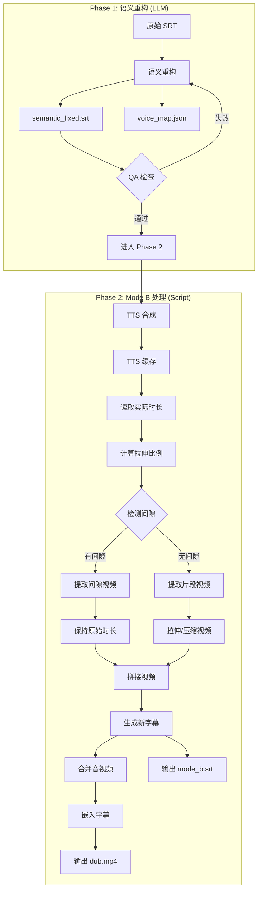

# Design Document: Mode B Sync Fix

## Overview

本设计文档描述了 Mode B（弹性视频）管线的三个关键问题的修复方案：

1. **音视频同步精确对齐**：重新设计 TTS 时长计算和视频拉伸逻辑
2. **Agent Manual v2 QA 环节**：添加强制性的质量检查机制
3. **自动生成新字幕**：在 Mode B 处理后生成匹配新时间轴的字幕文件

## Architecture



## Components and Interfaces

### 1. TTS Duration Calculator

**职责**：从 TTS 缓存文件读取实际音频时长

```python
def get_actual_tts_duration(cache_path: str) -> int:
    """
    从 TTS 缓存文件读取实际音频时长
    
    Args:
        cache_path: TTS 缓存文件路径
        
    Returns:
        音频时长（毫秒）
    """
```

### 2. Gap Detector

**职责**：检测字幕片段之间的间隙

```python
def detect_gaps(items: List[SRTItem], min_gap_ms: int = 100) -> List[Gap]:
    """
    检测字幕片段之间的间隙
    
    Args:
        items: 字幕片段列表
        min_gap_ms: 最小间隙阈值（毫秒），小于此值的间隙将被忽略
        
    Returns:
        间隙列表，每个间隙包含 start_ms, end_ms, duration_ms
    """
```

### 3. Video Segment Processor

**职责**：处理视频片段的提取和拉伸

```python
def process_video_segment(
    video_path: str,
    start_ms: int,
    end_ms: int,
    target_duration_ms: int,
    is_gap: bool = False
) -> str:
    """
    处理视频片段
    
    Args:
        video_path: 源视频路径
        start_ms: 片段开始时间
        end_ms: 片段结束时间
        target_duration_ms: 目标时长
        is_gap: 是否为间隙片段（间隙片段不拉伸）
        
    Returns:
        处理后的视频片段路径
    """
```

### 4. Subtitle Generator

**职责**：生成新时间轴的字幕文件

```python
def generate_mode_b_subtitle(
    items: List[SRTItem],
    tts_durations: List[int],
    gaps: List[Gap],
    output_path: str,
    keep_speaker_tags: bool = True
) -> str:
    """
    生成 Mode B 新时间轴字幕
    
    Args:
        items: 原始字幕片段列表
        tts_durations: 每个片段的 TTS 时长列表
        gaps: 间隙列表
        output_path: 输出路径
        keep_speaker_tags: 是否保留说话人标签
        
    Returns:
        生成的字幕文件路径
    """
```

### 5. QA Checker

**职责**：执行语义重构的质量检查

```python
def run_qa_checks(srt_path: str, voice_map_path: str = None) -> QAReport:
    """
    执行质量检查
    
    Args:
        srt_path: 字幕文件路径
        voice_map_path: voice_map.json 路径（可选）
        
    Returns:
        QA 报告，包含所有检查项的结果
    """
```

## Data Models

### Gap

```python
@dataclass
class Gap:
    """字幕间隙"""
    start_ms: int      # 间隙开始时间
    end_ms: int        # 间隙结束时间
    duration_ms: int   # 间隙时长
    prev_index: int    # 前一个片段的索引
    next_index: int    # 后一个片段的索引
```

### SegmentInfo

```python
@dataclass
class SegmentInfo:
    """片段处理信息"""
    index: int                 # 片段索引
    original_start_ms: int     # 原始开始时间
    original_end_ms: int       # 原始结束时间
    original_duration_ms: int  # 原始时长
    tts_duration_ms: int       # TTS 时长
    new_start_ms: int          # 新开始时间
    new_end_ms: int            # 新结束时间
    stretch_ratio: float       # 拉伸比例
    is_gap: bool               # 是否为间隙
    text: str                  # 文本内容
```

### QAReport

```python
@dataclass
class QAReport:
    """质量检查报告"""
    srt_valid: bool                    # SRT 格式是否有效
    speaker_coverage: float            # 说话人标签覆盖率
    missing_speakers: List[int]        # 缺少标签的片段索引
    timeline_complete: bool            # 时间轴是否完整
    first_start_ms: int                # 第一个片段开始时间
    last_end_ms: int                   # 最后一个片段结束时间
    max_chars_exceeded: List[int]      # 超过字符限制的片段索引
    max_duration_exceeded: List[int]   # 超过时长限制的片段索引
    voice_map_valid: bool              # voice_map.json 是否有效
    voice_map_has_default: bool        # 是否包含 DEFAULT
    all_passed: bool                   # 是否所有检查通过
```

### SyncDiagnostics

```python
@dataclass
class SyncDiagnostics:
    """同步诊断信息"""
    segments: List[SegmentInfo]        # 所有片段信息
    total_original_ms: int             # 原始总时长
    total_new_ms: int                  # 新总时长
    overall_ratio: float               # 整体拉伸比例
    warnings: List[str]                # 警告信息
```

## Correctness Properties

*A property is a characteristic or behavior that should hold true across all valid executions of a system-essentially, a formal statement about what the system should do. Properties serve as the bridge between human-readable specifications and machine-verifiable correctness guarantees.*

### Property 1: TTS 时长读取准确性

*For any* TTS 缓存文件，读取的时长应该与文件的实际音频时长一致（误差 < 10ms）

**Validates: Requirements 1.1**

### Property 2: 间隙片段不拉伸

*For any* 字幕序列中的间隙（gap > 100ms），对应的视频片段拉伸比例应该为 1.0

**Validates: Requirements 1.2, 5.2**

### Property 3: 空白片段跳过

*For any* 文本为空或仅包含空白字符的字幕片段，应该被跳过 TTS 合成，且保留原始视频时长

**Validates: Requirements 1.3**

### Property 4: 拉伸比例计算正确性

*For any* 非空字幕片段，拉伸比例应该等于 TTS 实际时长 / 原始片段时长

**Validates: Requirements 1.4**

### Property 5: 总时长一致性

*For any* Mode B 处理结果，输出视频的总时长应该等于所有 TTS 音频时长 + 所有间隙时长的总和

**Validates: Requirements 1.5**

### Property 6: 说话人标签覆盖率检查

*For any* 语义重构后的 SRT 文件，检查函数应该能正确计算说话人标签覆盖率，并识别所有缺少标签的片段

**Validates: Requirements 2.3**

### Property 7: 时间轴完整性检查

*For any* SRT 文件和视频时长，检查函数应该能正确判断时间轴是否覆盖整个视频

**Validates: Requirements 2.4**

### Property 8: 新字幕时间轴正确性

*For any* Mode B 处理结果，生成的新字幕中每个片段的开始时间应该等于前面所有片段（包括间隙）的时长之和

**Validates: Requirements 3.1, 3.2**

### Property 9: 说话人标签保留/移除

*For any* 包含说话人标签的字幕，根据用户选择，生成的新字幕应该正确保留或移除标签

**Validates: Requirements 3.6**

### Property 10: 异常拉伸比例警告

*For any* 拉伸比例 < 0.3 或 > 3.0 的片段，系统应该输出警告信息

**Validates: Requirements 4.3**

### Property 11: 间隙检测正确性

*For any* 字幕序列，间隙检测函数应该正确识别所有 > 100ms 的间隙，并忽略 <= 100ms 的间隙

**Validates: Requirements 5.1, 5.5**

### Property 12: 静音音频时长正确性

*For any* 间隙，生成的静音音频时长应该与间隙时长一致（误差 < 10ms）

**Validates: Requirements 5.3**

## Error Handling

### TTS 合成失败

```python
try:
    tts_path = await synthesize_tts(text, voice)
except TTSError as e:
    if args.no_fallback:
        raise
    # 回退到 macOS Say
    tts_path = await synthesize_tts(text, "Ting-Ting", backend="macos_say")
```

### 视频提取失败

```python
try:
    segment_path = extract_video_segment(video_path, start_ms, end_ms)
except FFmpegError as e:
    logger.warning(f"Failed to extract segment {index}: {e}")
    # 跳过该片段，记录警告
    warnings.append(f"Segment {index} extraction failed")
```

### 拉伸比例异常

```python
if ratio < 0.3 or ratio > 3.0:
    logger.warning(f"Abnormal stretch ratio {ratio:.3f} for segment {index}")
    warnings.append(f"Segment {index}: ratio={ratio:.3f} (abnormal)")
```

## Testing Strategy

### 单元测试

1. **TTS 时长读取测试**
   - 测试不同格式的音频文件（WAV, MP3）
   - 测试空文件和损坏文件的处理

2. **间隙检测测试**
   - 测试无间隙的字幕序列
   - 测试有多个间隙的字幕序列
   - 测试边界情况（间隙恰好 100ms）

3. **QA 检查测试**
   - 测试完全符合要求的 SRT
   - 测试缺少说话人标签的 SRT
   - 测试时间轴不完整的 SRT

### 属性测试

使用 `hypothesis` 库进行属性测试：

```python
from hypothesis import given, strategies as st

@given(st.lists(st.integers(min_value=100, max_value=10000), min_size=2))
def test_gap_detection_property(durations):
    """
    **Feature: mode-b-sync-fix, Property 11: 间隙检测正确性**
    """
    # 生成带有随机间隙的字幕序列
    items = generate_srt_with_gaps(durations)
    gaps = detect_gaps(items, min_gap_ms=100)
    
    # 验证所有检测到的间隙都 > 100ms
    for gap in gaps:
        assert gap.duration_ms > 100
```

### 集成测试

1. **端到端 Mode B 处理测试**
   - 使用测试视频和字幕
   - 验证输出视频时长
   - 验证新字幕时间轴

2. **QA 流程测试**
   - 模拟 Agent 执行语义重构
   - 验证 QA 检查能正确拦截问题

### 测试框架

- **单元测试**: pytest
- **属性测试**: hypothesis
- **集成测试**: pytest + ffprobe 验证
