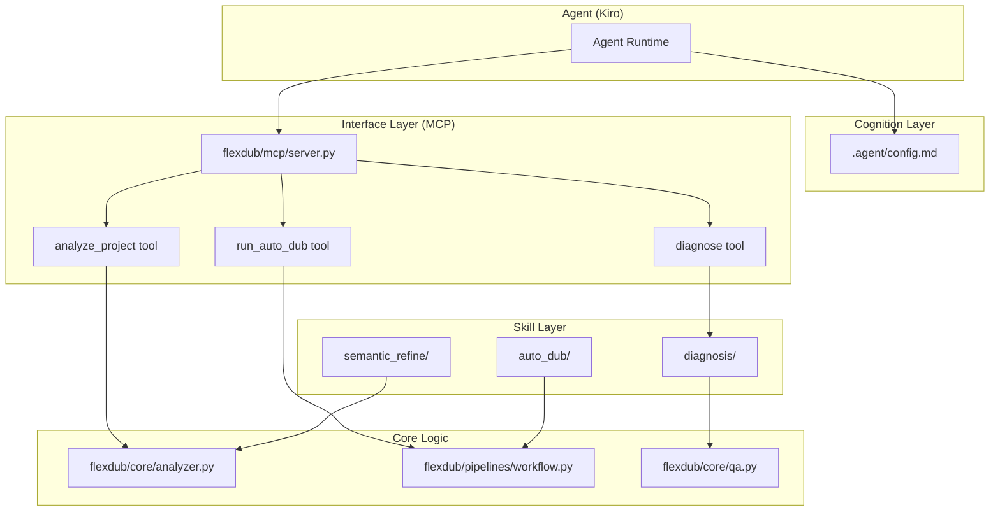

# Design Document: Universal Agent Architecture

## Overview

This design document describes the refactoring of FlexDub from a "Markdown-Driven" architecture (v2) to a "Universal Agent Architecture" (v3). The core philosophy is **"Thick Code, Thin Prompts"** - moving business logic from Markdown documentation into executable Python code.

The architecture consists of three layers:
1. **Cognition Layer** (`.agent/config.md`) - Project context and directives for the agent
2. **Interface Layer** (`flexdub/mcp/`) - MCP server exposing Python functions as tools
3. **Skill Layer** (`.agent/skills/`) - Modular knowledge packages with domain-specific logic

## Architecture



## Components and Interfaces

### 1. Cognition Layer

**File:** `.agent/config.md`

**Purpose:** Provide the agent with project context without embedding business logic.

**Content Structure:**
```markdown
# FlexDub Project Configuration

## Project Overview
- Elastic dubbing pipeline for video localization
- Processes SRT subtitles and video files

## Directory Structure
- `flexdub/core/` - Core algorithms
- `flexdub/pipelines/` - High-level workflows
- `flexdub/mcp/` - MCP tool interface
- `data/input/` - Project inputs
- `data/output/` - Processing outputs

## Core Directives
1. Use MCP tools for all operations
2. Do not directly modify output files
3. Always run QA after generating SRT files
```

### 2. Interface Layer (MCP Server)

**Module:** `flexdub/mcp/server.py`

**Dependencies:**
- `mcp` (Model Context Protocol SDK)
- `pydantic` (for input validation)

**Server Class:**
```python
from mcp.server import Server
from mcp.server.stdio import stdio_server
from pydantic import BaseModel

class FlexDubMCPServer:
    def __init__(self):
        self.server = Server("flexdub")
        self._register_tools()
    
    def _register_tools(self):
        # Register analyze_project, run_auto_dub, diagnose
        pass
    
    async def run(self):
        async with stdio_server() as (read, write):
            await self.server.run(read, write)
```

**Tool Interfaces:**

#### analyze_project

```python
class AnalyzeProjectInput(BaseModel):
    project_path: str
    
class AnalyzeProjectOutput(BaseModel):
    video_duration_ms: int
    srt_segment_count: int
    average_cpm: float
    max_cpm: float
    recommended_mode: str  # "A" or "B"
    recommended_params: dict
    validation_errors: list[str]
```

#### run_auto_dub

```python
class AutoDubInput(BaseModel):
    project_path: str
    mode: str = "A"  # "A" or "B"
    voice: str = "zh-CN-YunjianNeural"
    voice_map_path: Optional[str] = None
    
class AutoDubOutput(BaseModel):
    success: bool
    output_path: Optional[str]
    duration_ms: int
    qa_passed: bool
    error_message: Optional[str]
    processing_stats: dict
```

#### diagnose

```python
class DiagnoseInput(BaseModel):
    error_report_path: str
    
class DiagnoseOutput(BaseModel):
    category: str  # "configuration", "input_quality", "resource", "unknown"
    description: str
    suggested_fixes: list[str]
    related_docs: list[str]
```

### 3. Skill Layer

Each skill is a self-contained module with:
- `SKILL.md` - When to use this skill
- `impl.py` or reference to `flexdub.core` - Implementation

#### Semantic Refinement Skill

**Location:** `.agent/skills/semantic_refine/`

**SKILL.md Content:**
```markdown
# Semantic Refinement Skill

## When to Use
- Translation quality is poor
- Sentences need restructuring for TTS
- Speaker identification is needed

## Capabilities
- Terminology preservation (software names, shortcuts)
- Speaker identification and tagging
- Sentence restructuring for fluency
```

**rules.json:**
```json
{
  "preserve_terms": {
    "software": ["Maya", "Blender", "ZBrush", "Photoshop"],
    "tools": ["Quad Draw", "UV Editor", "Node Editor"],
    "shortcuts": ["Ctrl", "Shift", "Alt", "Tab"]
  },
  "speaker_patterns": [
    "^- ",
    "^— ",
    "\\[Speaker:",
    "【Speaker:"
  ],
  "mode_limits": {
    "A": {"max_chars": 250, "max_duration_ms": 15000},
    "B": {"max_chars": 100, "max_duration_ms": 6000}
  }
}
```

#### Auto-Dub Workflow Skill

**Location:** `.agent/skills/auto_dub/`

**Core Implementation:** `flexdub/pipelines/workflow.py`

```python
class DubbingWorkflow:
    def __init__(self, config: WorkflowConfig):
        self.config = config
        self.max_retries = 3
    
    async def run(self, project_path: str) -> WorkflowResult:
        """Execute the complete dubbing workflow with retry logic."""
        for attempt in range(self.max_retries):
            try:
                # 1. Validate project
                validation = self._validate_project(project_path)
                if not validation.is_valid:
                    return WorkflowResult(success=False, error=validation.error)
                
                # 2. Run rebalance (if Mode A)
                if self.config.mode == "A":
                    self._run_rebalance(project_path)
                
                # 3. Run TTS synthesis
                self._run_tts(project_path)
                
                # 4. Run merge
                output_path = self._run_merge(project_path)
                
                # 5. Run QA
                qa_result = self._run_qa(output_path)
                if not qa_result.passed:
                    if attempt < self.max_retries - 1:
                        self._attempt_remediation(qa_result)
                        continue
                    return WorkflowResult(success=False, error="QA failed")
                
                return WorkflowResult(success=True, output_path=output_path)
                
            except Exception as e:
                if attempt < self.max_retries - 1:
                    continue
                return WorkflowResult(success=False, error=str(e))
```

#### Diagnosis Skill

**Location:** `.agent/skills/diagnosis/`

**error_codes.json:**
```json
{
  "E001": {
    "pattern": "Edge TTS.*timeout",
    "category": "resource",
    "description": "Edge TTS network timeout",
    "fixes": [
      "Check network connectivity",
      "Reduce --jobs to 1",
      "Use --no-fallback to fail fast"
    ]
  },
  "E002": {
    "pattern": "CPM.*exceeded",
    "category": "input_quality",
    "description": "CPM exceeds safe threshold",
    "fixes": [
      "Use Mode B for natural speech",
      "Reduce --target-cpm to 160",
      "Split long segments"
    ]
  }
}
```

### 4. Project Analyzer

**Module:** `flexdub/core/analyzer.py`

This module consolidates decision logic from the v2 manual.

```python
from dataclasses import dataclass
from typing import List, Optional
import os
import subprocess
import json

from flexdub.core.subtitle import read_srt, SRTItem
from flexdub.core.rebalance import _cpm


@dataclass
class VideoMetrics:
    duration_ms: int
    width: int
    height: int
    fps: float


@dataclass
class SRTMetrics:
    segment_count: int
    total_chars: int
    average_cpm: float
    max_cpm: float
    min_cpm: float
    high_density_segments: List[int]  # indices with CPM > 300


@dataclass
class ProjectAnalysis:
    project_path: str
    video_metrics: Optional[VideoMetrics]
    srt_metrics: Optional[SRTMetrics]
    recommended_mode: str  # "A" or "B"
    recommended_params: dict
    validation_errors: List[str]


def get_video_metrics(video_path: str) -> VideoMetrics:
    """Extract video metrics using ffprobe."""
    cmd = [
        "ffprobe", "-v", "quiet", "-print_format", "json",
        "-show_format", "-show_streams", video_path
    ]
    result = subprocess.run(cmd, capture_output=True, text=True)
    data = json.loads(result.stdout)
    
    duration_ms = int(float(data["format"]["duration"]) * 1000)
    
    video_stream = next(
        (s for s in data["streams"] if s["codec_type"] == "video"),
        None
    )
    
    width = video_stream["width"] if video_stream else 0
    height = video_stream["height"] if video_stream else 0
    fps = eval(video_stream.get("r_frame_rate", "0/1")) if video_stream else 0
    
    return VideoMetrics(duration_ms, width, height, fps)


def get_srt_metrics(srt_path: str) -> SRTMetrics:
    """Calculate SRT metrics including CPM analysis."""
    items = read_srt(srt_path)
    
    cpms = []
    high_density = []
    total_chars = 0
    
    for idx, item in enumerate(items):
        chars = len(item.text.strip())
        total_chars += chars
        duration_ms = item.end_ms - item.start_ms
        cpm = _cpm(item.text, duration_ms)
        cpms.append(cpm)
        
        if cpm > 300:
            high_density.append(idx)
    
    return SRTMetrics(
        segment_count=len(items),
        total_chars=total_chars,
        average_cpm=sum(cpms) / len(cpms) if cpms else 0,
        max_cpm=max(cpms) if cpms else 0,
        min_cpm=min(cpms) if cpms else 0,
        high_density_segments=high_density
    )


def recommend_mode(srt_metrics: SRTMetrics) -> tuple[str, dict]:
    """
    Recommend processing mode based on CPM analysis.
    
    Decision logic (from v2 manual section 2.0):
    - CPM > 300: Mode B (elastic-video) recommended
    - CPM <= 300: Mode A (elastic-audio) recommended
    """
    if srt_metrics.max_cpm > 300 or len(srt_metrics.high_density_segments) > 0:
        return "B", {
            "mode": "elastic-video",
            "no_rebalance": True,
            "max_chars": 100,
            "max_duration_ms": 6000,
            "reason": f"High CPM detected (max: {srt_metrics.max_cpm:.0f})"
        }
    else:
        return "A", {
            "mode": "elastic-audio",
            "clustered": True,
            "target_cpm": 180,
            "panic_cpm": 300,
            "max_chars": 250,
            "max_duration_ms": 15000,
            "reason": f"Normal CPM range (avg: {srt_metrics.average_cpm:.0f})"
        }


def analyze_project(project_path: str) -> ProjectAnalysis:
    """
    Analyze a project directory and return recommendations.
    
    Validates:
    - Exactly 1 MP4 file exists
    - Exactly 1 SRT file exists
    - Files are readable
    """
    errors = []
    video_metrics = None
    srt_metrics = None
    
    # Find video and SRT files
    mp4_files = [f for f in os.listdir(project_path) if f.endswith(".mp4")]
    srt_files = [f for f in os.listdir(project_path) if f.endswith(".srt")]
    
    if len(mp4_files) != 1:
        errors.append(f"Expected 1 MP4 file, found {len(mp4_files)}")
    if len(srt_files) != 1:
        errors.append(f"Expected 1 SRT file, found {len(srt_files)}")
    
    if not errors:
        video_path = os.path.join(project_path, mp4_files[0])
        srt_path = os.path.join(project_path, srt_files[0])
        
        try:
            video_metrics = get_video_metrics(video_path)
        except Exception as e:
            errors.append(f"Failed to read video: {e}")
        
        try:
            srt_metrics = get_srt_metrics(srt_path)
        except Exception as e:
            errors.append(f"Failed to read SRT: {e}")
    
    # Determine recommendation
    if srt_metrics:
        mode, params = recommend_mode(srt_metrics)
    else:
        mode, params = "A", {"reason": "Default (no SRT metrics available)"}
    
    return ProjectAnalysis(
        project_path=project_path,
        video_metrics=video_metrics,
        srt_metrics=srt_metrics,
        recommended_mode=mode,
        recommended_params=params,
        validation_errors=errors
    )
```

## Data Models

### Core Data Structures

```python
# From flexdub/core/subtitle.py
@dataclass
class SRTItem:
    start_ms: int
    end_ms: int
    text: str

# From flexdub/core/rebalance.py
@dataclass
class Segment:
    start_ms: int
    end_ms: int
    text: str
    
    @property
    def duration_ms(self) -> int:
        return max(0, self.end_ms - self.start_ms)

# New: Analysis results
@dataclass
class ProjectAnalysis:
    project_path: str
    video_metrics: Optional[VideoMetrics]
    srt_metrics: Optional[SRTMetrics]
    recommended_mode: str
    recommended_params: dict
    validation_errors: List[str]

# New: Workflow results
@dataclass
class WorkflowResult:
    success: bool
    output_path: Optional[str] = None
    duration_ms: int = 0
    qa_passed: bool = False
    error_message: Optional[str] = None
    processing_stats: dict = field(default_factory=dict)
```

### MCP Tool Schemas (Pydantic)

```python
from pydantic import BaseModel, Field
from typing import Optional, List

class AnalyzeProjectInput(BaseModel):
    project_path: str = Field(..., description="Path to project directory")

class AnalyzeProjectOutput(BaseModel):
    video_duration_ms: int
    srt_segment_count: int
    average_cpm: float
    max_cpm: float
    recommended_mode: str
    recommended_params: dict
    validation_errors: List[str]

class AutoDubInput(BaseModel):
    project_path: str
    mode: str = Field(default="A", pattern="^[AB]$")
    voice: str = Field(default="zh-CN-YunjianNeural")
    voice_map_path: Optional[str] = None
    jobs: int = Field(default=4, ge=1, le=8)

class AutoDubOutput(BaseModel):
    success: bool
    output_path: Optional[str]
    duration_ms: int
    qa_passed: bool
    error_message: Optional[str]
    processing_stats: dict

class DiagnoseInput(BaseModel):
    error_report_path: str

class DiagnoseOutput(BaseModel):
    category: str
    description: str
    suggested_fixes: List[str]
    related_docs: List[str]
```


## Correctness Properties

*A property is a characteristic or behavior that should hold true across all valid executions of a system-essentially, a formal statement about what the system should do. Properties serve as the bridge between human-readable specifications and machine-verifiable correctness guarantees.*

Based on the acceptance criteria analysis, the following correctness properties must be validated through property-based testing:

### Property 1: Config file excludes business logic

*For any* `.agent/config.md` file, scanning the content should NOT find patterns indicating business logic (CPM thresholds, if/else decision trees, mode selection rules).

**Validates: Requirements 1.4**

### Property 2: MCP tool response validity

*For any* MCP tool call with any input (valid or invalid), the response must be valid JSON containing either a success result or a structured error with descriptive message. The server must not crash.

**Validates: Requirements 2.4, 2.5**

### Property 3: MCP tool schema completeness

*For any* registered MCP tool, the tool must have a Pydantic input schema with typed fields and descriptions.

**Validates: Requirements 2.3**

### Property 4: analyze_project output completeness

*For any* valid project directory (containing 1 MP4 and 1 SRT), the `analyze_project` tool must return all required fields: `video_duration_ms`, `average_cpm`, `max_cpm`, `recommended_mode`, `recommended_params`.

**Validates: Requirements 3.1, 3.2, 3.3**

### Property 5: Mode B recommendation for high CPM

*For any* SRT file where max CPM exceeds 300, the `recommend_mode` function must return mode "B" (elastic-video).

**Validates: Requirements 3.4**

### Property 6: Mode A recommendation for normal CPM

*For any* SRT file where max CPM is at or below 300, the `recommend_mode` function must return mode "A" (elastic-audio).

**Validates: Requirements 3.5**

### Property 7: Invalid project error reporting

*For any* invalid project path (missing files, wrong file count, unreadable files), the `analyze_project` tool must return a non-empty `validation_errors` list with specific failure descriptions.

**Validates: Requirements 3.6**

### Property 8: Terminology preservation in refinement

*For any* text containing terms from the preservation rules (software names, shortcuts, technical terms), the refinement function must preserve those terms unchanged in the output.

**Validates: Requirements 4.4**

### Property 9: Mode-specific segment limits

*For any* refinement output, all segments must respect the mode-specific limits: Mode A (≤250 chars, ≤15s), Mode B (≤100 chars, ≤6s).

**Validates: Requirements 4.5**

### Property 10: Workflow retry on failure

*For any* pipeline step that fails, the workflow must attempt retry with fallback parameters before reporting final failure, up to the configured retry limit.

**Validates: Requirements 5.2**

### Property 11: Automatic QA after pipeline completion

*For any* successful pipeline execution, QA validation must be automatically executed before returning the result.

**Validates: Requirements 5.3**

### Property 12: QA remediation attempts

*For any* QA validation failure, the workflow must attempt automatic remediation up to the configured retry limit before reporting failure.

**Validates: Requirements 5.4**

### Property 13: Workflow success report completeness

*For any* successful workflow execution, the result must contain `processing_stats` with duration, segment count, and mode information.

**Validates: Requirements 5.5**

### Property 14: Diagnosis fix suggestions

*For any* error report analyzed by the diagnosis skill, the output must contain a non-empty `suggested_fixes` list with actionable recommendations.

**Validates: Requirements 6.2**

### Property 15: Known error pattern matching

*For any* error report matching a known pattern in `error_codes.json`, the diagnosis must return the specific remediation steps defined for that pattern.

**Validates: Requirements 6.3**

### Property 16: Diagnosis category validity

*For any* diagnosis output, the `category` field must be one of: "configuration", "input_quality", "resource", "unknown".

**Validates: Requirements 6.4**

### Property 17: V3 manual excludes business logic

*For any* `agent_manual.md` file, scanning the content should NOT find patterns indicating decision trees, pseudo-code, or detailed business logic.

**Validates: Requirements 7.4**

### Property 18: CLI backward compatibility

*For any* existing CLI command with any valid input, the output after refactoring must be identical to the output before refactoring (regression test).

**Validates: Requirements 9.2, 9.3**

## Error Handling

### MCP Server Errors

| Error Type | Response Format | Recovery Action |
|------------|-----------------|-----------------|
| Invalid input | `{"error": "validation_error", "message": "...", "field": "..."}` | Return error, continue serving |
| Tool execution failure | `{"error": "execution_error", "message": "...", "traceback": "..."}` | Log error, return response |
| Resource unavailable | `{"error": "resource_error", "message": "...", "resource": "..."}` | Retry with backoff, then fail |
| Unknown error | `{"error": "unknown_error", "message": "..."}` | Log full traceback, return generic error |

### Workflow Errors

```python
class WorkflowError(Exception):
    """Base class for workflow errors."""
    def __init__(self, step: str, message: str, recoverable: bool = True):
        self.step = step
        self.message = message
        self.recoverable = recoverable
        super().__init__(f"[{step}] {message}")

class ValidationError(WorkflowError):
    """Project validation failed."""
    def __init__(self, errors: List[str]):
        super().__init__("validation", f"Validation failed: {errors}", recoverable=False)
        self.errors = errors

class TTSError(WorkflowError):
    """TTS synthesis failed."""
    def __init__(self, segment_idx: int, message: str):
        super().__init__("tts", f"Segment {segment_idx}: {message}", recoverable=True)
        self.segment_idx = segment_idx

class QAError(WorkflowError):
    """QA validation failed."""
    def __init__(self, report: QAReport):
        super().__init__("qa", f"QA failed: {report}", recoverable=True)
        self.report = report
```

### Retry Strategy

```python
class RetryConfig:
    max_attempts: int = 3
    backoff_base: float = 1.0
    backoff_multiplier: float = 2.0
    max_backoff: float = 30.0

async def with_retry(func, config: RetryConfig):
    """Execute function with exponential backoff retry."""
    last_error = None
    for attempt in range(config.max_attempts):
        try:
            return await func()
        except WorkflowError as e:
            if not e.recoverable:
                raise
            last_error = e
            delay = min(
                config.backoff_base * (config.backoff_multiplier ** attempt),
                config.max_backoff
            )
            await asyncio.sleep(delay)
    raise last_error
```

## Testing Strategy

### Dual Testing Approach

This project uses both unit tests and property-based tests:

- **Unit tests**: Verify specific examples, edge cases, and integration points
- **Property-based tests**: Verify universal properties that should hold across all inputs

### Property-Based Testing Framework

**Library:** `hypothesis` (Python)

**Configuration:**
```python
from hypothesis import settings, Verbosity

# Configure minimum 100 iterations per property test
settings.register_profile("ci", max_examples=100)
settings.register_profile("dev", max_examples=50)
settings.load_profile("ci")
```

### Test Organization

```
tests/
├── unit/
│   ├── test_analyzer.py          # Unit tests for analyzer module
│   ├── test_mcp_server.py        # Unit tests for MCP server
│   └── test_workflow.py          # Unit tests for workflow
├── property/
│   ├── test_analyzer_props.py    # Property tests for analyzer
│   ├── test_mcp_props.py         # Property tests for MCP tools
│   ├── test_workflow_props.py    # Property tests for workflow
│   └── test_diagnosis_props.py   # Property tests for diagnosis
└── integration/
    ├── test_mcp_integration.py   # MCP tool integration tests
    └── test_cli_regression.py    # CLI backward compatibility tests
```

### Property Test Examples

```python
# tests/property/test_analyzer_props.py
from hypothesis import given, strategies as st
from flexdub.core.analyzer import recommend_mode, SRTMetrics

# **Feature: universal-agent-architecture, Property 5: Mode B recommendation for high CPM**
# **Validates: Requirements 3.4**
@given(
    max_cpm=st.floats(min_value=301, max_value=1000),
    avg_cpm=st.floats(min_value=100, max_value=500),
    segment_count=st.integers(min_value=1, max_value=500)
)
def test_high_cpm_recommends_mode_b(max_cpm, avg_cpm, segment_count):
    """For any SRT with max CPM > 300, mode must be B."""
    metrics = SRTMetrics(
        segment_count=segment_count,
        total_chars=segment_count * 50,
        average_cpm=avg_cpm,
        max_cpm=max_cpm,
        min_cpm=100,
        high_density_segments=[0] if max_cpm > 300 else []
    )
    mode, params = recommend_mode(metrics)
    assert mode == "B"
    assert params["mode"] == "elastic-video"


# **Feature: universal-agent-architecture, Property 6: Mode A recommendation for normal CPM**
# **Validates: Requirements 3.5**
@given(
    max_cpm=st.floats(min_value=100, max_value=300),
    avg_cpm=st.floats(min_value=100, max_value=300),
    segment_count=st.integers(min_value=1, max_value=500)
)
def test_normal_cpm_recommends_mode_a(max_cpm, avg_cpm, segment_count):
    """For any SRT with max CPM <= 300, mode must be A."""
    metrics = SRTMetrics(
        segment_count=segment_count,
        total_chars=segment_count * 50,
        average_cpm=avg_cpm,
        max_cpm=max_cpm,
        min_cpm=100,
        high_density_segments=[]
    )
    mode, params = recommend_mode(metrics)
    assert mode == "A"
    assert params["mode"] == "elastic-audio"
```

```python
# tests/property/test_mcp_props.py
from hypothesis import given, strategies as st
import json

# **Feature: universal-agent-architecture, Property 2: MCP tool response validity**
# **Validates: Requirements 2.4, 2.5**
@given(
    project_path=st.text(min_size=1, max_size=100)
)
def test_mcp_response_is_valid_json(project_path):
    """For any input, MCP tool returns valid JSON with status."""
    server = FlexDubMCPServer()
    response = server.call_tool("analyze_project", {"project_path": project_path})
    
    # Response must be valid JSON
    parsed = json.loads(response)
    
    # Must have either result or error
    assert "result" in parsed or "error" in parsed
    
    # If error, must have message
    if "error" in parsed:
        assert "message" in parsed
```

```python
# tests/property/test_diagnosis_props.py
from hypothesis import given, strategies as st

# **Feature: universal-agent-architecture, Property 16: Diagnosis category validity**
# **Validates: Requirements 6.4**
VALID_CATEGORIES = {"configuration", "input_quality", "resource", "unknown"}

@given(
    error_text=st.text(min_size=1, max_size=500)
)
def test_diagnosis_category_is_valid(error_text):
    """For any diagnosis, category must be one of the valid values."""
    result = diagnose_error(error_text)
    assert result.category in VALID_CATEGORIES
```

### Unit Test Examples

```python
# tests/unit/test_analyzer.py
import pytest
from flexdub.core.analyzer import get_srt_metrics, analyze_project

def test_get_srt_metrics_calculates_cpm():
    """Test CPM calculation for known input."""
    # Create test SRT with known values
    # 60 chars in 1000ms = 3600 CPM
    metrics = get_srt_metrics("tests/fixtures/high_cpm.srt")
    assert metrics.max_cpm > 300

def test_analyze_project_validates_file_count():
    """Test validation of project structure."""
    result = analyze_project("tests/fixtures/invalid_project/")
    assert len(result.validation_errors) > 0
    assert "MP4" in result.validation_errors[0] or "SRT" in result.validation_errors[0]
```

### Integration Test Examples

```python
# tests/integration/test_cli_regression.py
import subprocess
import pytest

def test_cli_audit_unchanged():
    """CLI audit command produces same output after refactoring."""
    result = subprocess.run(
        ["python", "-m", "flexdub", "audit", "tests/fixtures/sample.srt"],
        capture_output=True, text=True
    )
    assert result.returncode == 0
    # Compare with baseline output
    with open("tests/fixtures/audit_baseline.txt") as f:
        assert result.stdout == f.read()
```

### Test Execution

```bash
# Run all tests
python -m pytest tests/ -v

# Run only property tests
python -m pytest tests/property/ -v

# Run with coverage
python -m pytest tests/ --cov=flexdub --cov-report=html
```
